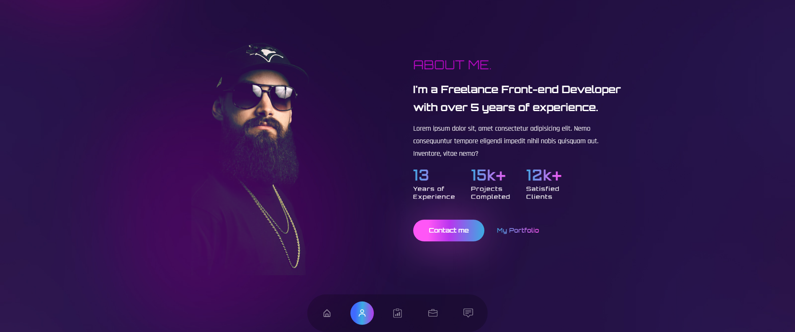

# React Portfolio 04
This design is inspired by this [video](https://youtu.be/Hps-XPN1GeE), which belongs to [Cristian Mihai](https://www.youtube.com/@cristianmihai01).

## Technologies
This web page was made with the following technologies:
- HTML5
- CSS3
- JavaScript
- React
- React Icons
- React Type Animation
- React Scroll
- React Countup
- React Intersection Observer
- Framer Motion
- Tailwind CSS

## Pages
This web page contains 5 sections: **Banner**, **About**, **Services**, **Work** and **Contact**.

### Banner
#### In this section you will see the title of the web page, an interactive subtitle, a brief description and a button that directs you to the contact section and another button that directs you to the portfolio section, below you will see some links to different social networks. And on the right side, an image.

### About
#### In this section, you'll see the section title, a subtitle, and a description. In addition, you will see the years of experience, the number of projects carried out and satisfied customers. You will also see a button that directs you to the contact section and another to the portfolio section.

### Services
#### In this section, you will see a section title and a subtitle. Also on the right hand side you will see a list of services that are offered.

### Work
#### In this section you can see all the projects that have been carried out. Each project has a title and the area to which it belongs.

### Contact
#### In this section you can see a form where you can enter your name, email and the message you want to send. The form is not functional.

